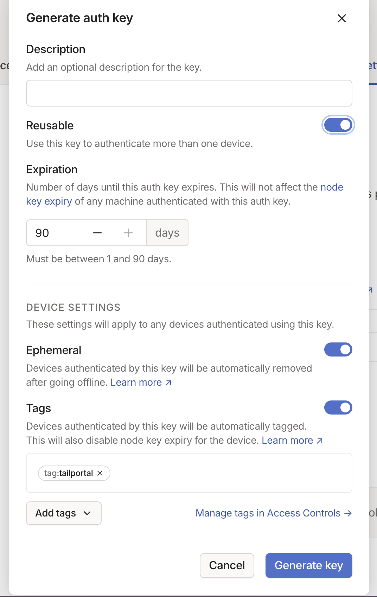

# tailportal

Create tailscale exit node with simple commands

Bring your own key and pay your own bill, and let me do the rest.

## Usage

### Step 1: Configuring your Tailnet

Add the following ACL changes:

```json
"tagOwners": {
  "tag:tailportal": ["autogroup:admin"],
},
"ssh": [
  // Allow all users to SSH into their own devices in check mode.
  // Comment this section out if you want to define specific restrictions.
  {
    "action": "check",
    "src":    ["autogroup:member"],
    "dst":    ["autogroup:self"],
    "users":  ["autogroup:nonroot", "root"],
  },
  {
    "action": "accept",
    // !!IMPORTANT Change this
    "src":    ["autogroup:member"],
    "dst":    ["tag:tailportal"],
    "users":  ["autogroup:nonroot", "root"],
  },
],
"autoApprovers": {
	"exitNode": ["tag:tailportal"],
},
```

2. Create tailscale authkey



### Step 2: Config Cloud Providers API

TBD: Vultr/Digital Ocean/AWS

## TODOs

- [ ] instance management: status, shutdown...
- [ ] simple TUI

## License

MIT
